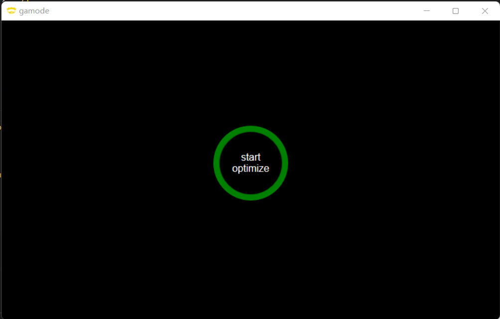

# gamode  

  

- [x] enable system builtin game mode  
- [x] disable <kbd>win</kbd> hotkeys  
- [x] load us keyboard layout for CJK users  
- [ ] disable File and Printer Sharing  
- [x] disable windows auto update  
- [x] disable mouse enhance pointer precision
- [x] switch to maximum performance power plan

## Development  

`nim c -d:release --app:gui .\src\gamode.nim`

assembly Manifests(require windows SDK)  

`mt.exe -manifest .\src\gamode.exe.manifest -outputresource:.\src\gamode.exe` 

set app icon  
`rcedit ".\src\gamode.exe" --set-icon "gamode.ico"`